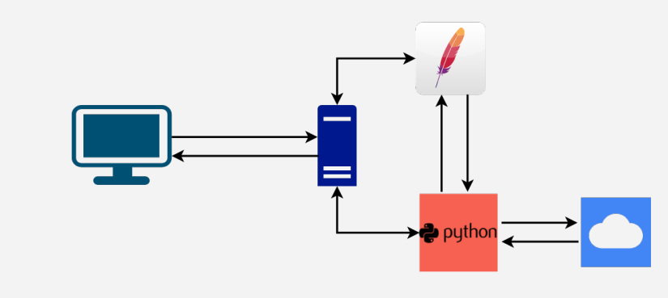
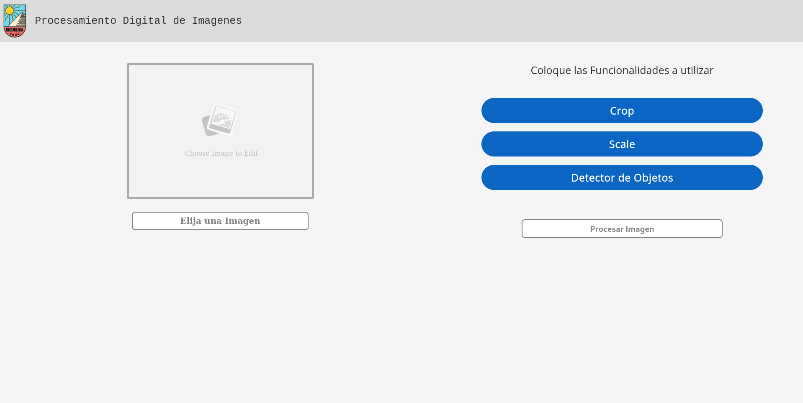

# Detección e Identificación de Objetos por Imágenes

Este proyecto integra un motor de inteligencia artificial desarrollado por [CodeProject](http://codeproject.com), que permite detectar e identificar objetos en imágenes. Los resultados se presentan en una interfaz web, y además, ofrece la opción de descargar metadatos con información detallada sobre el nombre y la ubicación de los objetos detectados.

La interfaz web fue desarrollada utilizando Flask, una biblioteca de Python reconocida por ser un microframework ligero, simple y flexible, ideal para crear aplicaciones web, APIs y microservicios.



## Instalación

### Python

Es necesario instalar las bibliotecas requeridas, incluyendo Flask y otras utilizadas para el procesamiento de imágenes. Para hacerlo, ejecuta el siguiente comando:

```bash
pip install -r requeriments.txt
```

### CodeProject

Para utilizar el motor de CodeProject, se debe desplegar en un contenedor Docker. Ejecuta el siguiente comando:

```bash
# Linux 
docker run --name CodeProject.AI -d -p 32168:32168 codeproject/ai-server
```

Luego, accede al servidor a través de la URL http://localhost:32168/. En el apartado Install Modules, instala el módulo **Object Detection (Coral)**.

## Uso

Para inicializar el servidor web, ejecuta el script main.py con el siguiente comando:

```bash
python3 main.py
```

Accede a la interfaz principal en http://127.0.0.1:5000. La interfaz incluye varias funciones, como se muestra a continuación:



## Referencias

https://www.codeproject.com/

https://flask.palletsprojects.com

https://www.python.org/
